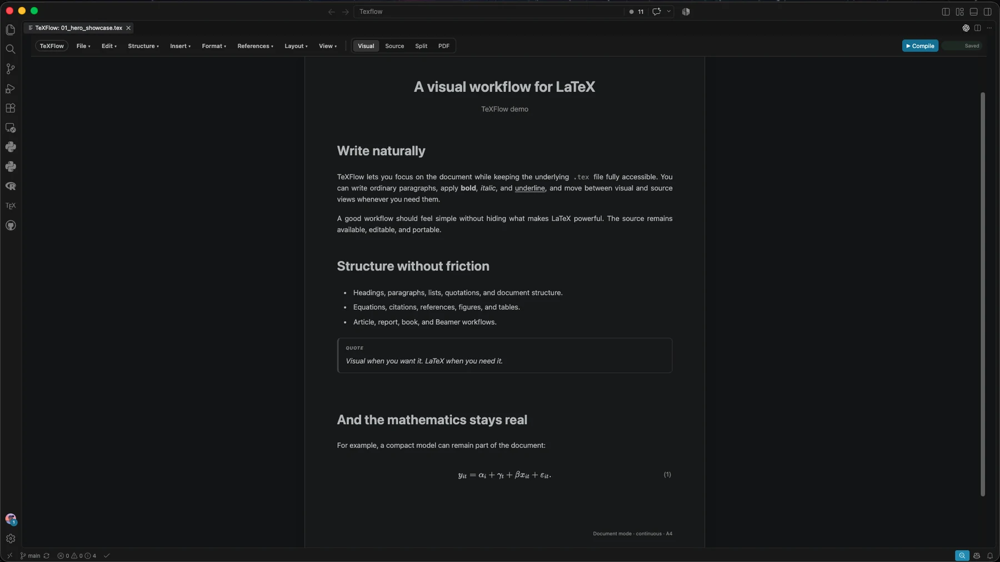

Economist

<h1 class="identity-title">Industrial Organization&amp; Applied Microeconomics</h1>

Full Professor of Economics at Universidad de la República. Research on retail pricing, price dispersion, competition, and economic regulation.

Applied work in competition policy, economic regulation, and market analysis.

<a class="btn-site btn-primary-site" href="research.html">Explore research →</a>
<a class="btn-site btn-secondary-site" href="files/english_CV.pdf">Download CV</a>

<strong>Research</strong>Industrial organization and applied microeconomics

<strong>Policy &amp; Advisory</strong>Competition, regulation &amp; market analysis

<strong>Teaching</strong>Graduate and undergraduate economics

<strong>Building</strong>TeXFlow — Visual LaTeX for VS Code

<section class="section">

Research
<h2>Selected work</h2>

Three selected publications in industrial organization and retail markets.

<article class="paper-card">
Journal of Industry, Competition and Trade · 2026
<h3 class="paper-title">The Border Effect on Prices: The Role of Local Product Availability</h3>
Fernando Borraz and Leandro Zipitría.

<a href="https://link.springer.com/article/10.1007/s10842-026-00466-z">Published article →</a><a href="files/Disentangling_Border_2026.pdf">Working paper</a>
</article>
<article class="paper-card featured-clean">
AEJ: Economic Policy · 2024
<h3 class="paper-title">Local Retail Prices, Product Varieties and Neighborhood Change</h3>
Fernando Borraz, Felipe Carozzi, Nicolás González-Pampillón, and Leandro Zipitría.

<a href="https://www.aeaweb.org/articles?id=10.1257/pol.20210817&&from=f">Published article →</a><a href="files/Borraz_AEJP_2021_R1.pdf">Working paper</a>
</article>
<article class="paper-card">
International Economics · 2022
<h3 class="paper-title">Varieties as a Source of Law of One Price Deviation</h3>
Fernando Borraz and Leandro Zipitría.

<a href="https://www.sciencedirect.com/science/article/abs/pii/S2110701722000543">Published article →</a><a href="files/LOP Version 2021_12_11.pdf">Working paper</a>
</article>

<a class="btn-site btn-secondary-site" href="research.html">All papers and projects →</a>

</section>

<section class="section alt">

Work
<h2>Research, policy, teaching — and tools.</h2>

<article class="info-card">01<h3>Research</h3>
Industrial organization and applied microeconomics, with a focus on retail pricing, price dispersion, and market structure.

<a href="research.html">Research →</a>
</article>
<article class="info-card">02<h3>Policy &amp; Advisory</h3>
Competition policy, economic regulation, market analysis, pricing, and regulatory impact.

<a href="professional.html">Professional work →</a>
</article>
<article class="info-card">03<h3>Teaching</h3>
Current graduate courses in Development Economics, Microeconomics II, and Economic Regulation & Competition Policy, plus a teaching archive.

<a href="teaching.html">Teaching →</a>
</article>

</section>

<section class="section dark">

TeXFlow — Visual LaTeX

<h2>Write LaTeX, without writing LaTeX.</h2>

A visual LaTeX editor inside VS Code. Write naturally while keeping your <code>.tex</code> files intact and accessible.

<a class="btn-site" style="background:#19bedf;color:#041423;border-color:#19bedf" href="texflow.html">See TeXFlow →</a><a class="btn-site" style="color:white;border-color:rgba(255,255,255,.35)" href="https://github.com/LeandroZipitria/texflow">GitHub</a>

</section>

<section class="section">

Writing & public discussion

<h2>Economics beyond papers.</h2>

I write occasionally about economic policy and institutions, and publish longer-form commentary in <strong>Mercados Chicos</strong>.

<a class="btn-site btn-secondary-site" href="blog.html">Writing & Media →</a><a class="btn-site btn-secondary-site" href="personal.html">Personal →</a>

“An image is worth a thousand words.” I also co-created <a href="https://www.unaimagen.uy/">unaimagen</a>, a side project focused on visualizing data from Uruguay.

</section>
