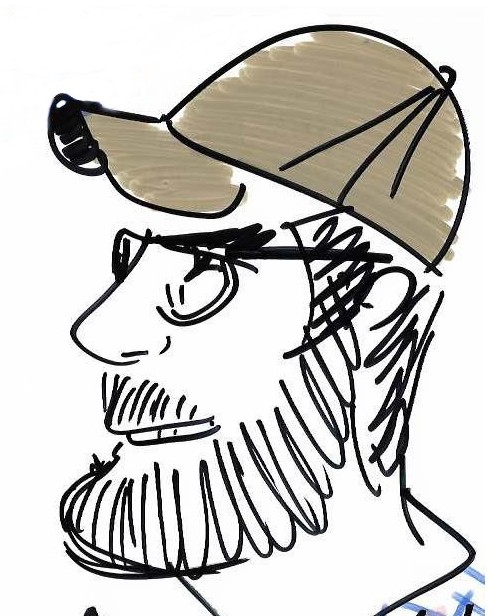
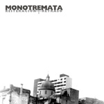

\

 **"If you're not having fun, you're doing something wrong."** Marx (Groucho) 

\

<link rel="stylesheet" href="styles.css" type="text/css">

\
\
\
\
\
\
\
\
\
\

A funny portrait made by a cuban street artist.

\

# Music

Music is an important part of my life. Here are links to the web pages of my favorite artists:

[Living Colour](http://www.livingcolour.com/), [Buckethead](https://buckethead.bandcamp.com/) and also [here](https://www.bucketheadpikes.com/), [Devin Townsend](http://www.hevydevy.com/news/), [Napalm Death](http://napalmdeath.org/scum/), [Meshuggah](https://www.meshuggah.net/).

I also support several artist through Bandcamp. There are so many talented musicians out there that show their music through non standard music platforms. You can check my personal collection [here](https://bandcamp.com/leandrozipitria).

----

# My own music

Some years ago I have some music bands, which are now disbanded. I used to play the guitar. Below are some recordings that I have made decades ago.

  

## Maldicion

This was an experimental industrial band. In 1996 we recorded a single called "Tedio". The songs were:

1. [Endurece como metal](files/music/01-maldicion-tedio-endurece-como-metal.ogg)
1. [Pameta](files/music/02-maldicion-tedio-palmeta.ogg)
1. [Dislocación](files/music/03-maldicion-tedio-dislocacion.ogg)
1. [Lo que va a pasar](files/music/04-maldicion-tedio-lo-que-va-a-pasar.ogg)

Lately, in 1997 we record a new song made completely using computers for the rhythm section. The song was called [“Less“](files/music/maldicion-less.ogg). Enjoy it.

  

## Monotremata

Lately, “Maldición” was disbanded. Some year later, we start “Monotremata” with Hernán González. We recorded a disc called “Reiteración + Retraso” in 2003. Guitars were recorded in my PC, but it sound pretty good ! (but noisy).

1. [Poco y malo](files/music/01_monontremata_reiteracionretraso_poco-y-malo.mp3)

1. [Solamente una vez](files/music/02_monontremata_reiteracionretraso_solamente-una-vez.mp3)

1. [Meditabajo](files/music/03_monontremata_reiteracionretraso_meditabajo.mp3)

1. [Simple](files/music/04_monontremata_reiteracionretraso_simple.mp3)

1. [Papel carbónico](files/music/05_monontremata_reiteracionretraso_papel-carbonico.mp3)

***

Last revision: `r format(Sys.Date(), "%B %d, %Y")`. Leandro Zipitría.