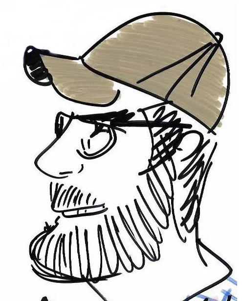
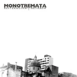

::: {.page-hero}
::: {.eyebrow}
Personal
:::

# Music and other things.

::: {.lead}
“If you're not having fun, you're doing something wrong.” — Groucho Marx
:::
:::

::: {.page-content}
::: {.split .align-start}
::: {.prose}
## Music

Music is an important part of my life. Some artists I return to are [Living Colour](http://www.livingcolour.com/), [Buckethead](https://buckethead.bandcamp.com/) (also [here](https://www.bucketheadpikes.com/)), [Devin Townsend](http://www.hevydevy.com/news/), [Napalm Death](http://napalmdeath.org/scum/), and [Meshuggah](https://www.meshuggah.net/).

I also support artists through Bandcamp. There are many talented musicians who release their work through non-standard music platforms. My personal Bandcamp collection is [here](https://bandcamp.com/leandrozipitria).

This page will keep growing with other music and personal material.
:::

::: {.personal-image}

::: {.paper-meta}
A portrait made by a Cuban street artist.
:::
:::
:::

::: {.list-section}
## My own music

### Maldición

This was an experimental industrial band. In 1996 we recorded a single called *Tedio*.

::: {.album-callout}
::: {.album-copy}
::: {.card-label}
Maldición · 1996
:::

### Tedio

The original four-track release is also available on Bandcamp.
:::

[Listen on Bandcamp →](https://maldicionuy.bandcamp.com/album/tedio-1996){.btn-site .btn-primary-site}
:::

::: {.track-list}
::: {.track-row}
[01]{.track-no}
[Endurece como metal](<files/music/01 - Maldicion - Tedio - Endurece como metal.mp3>)
:::

::: {.track-row}
[02]{.track-no}
[Palmeta](<files/music/02 - Maldicion - Tedio - Palmeta.mp3>)
:::

::: {.track-row}
[03]{.track-no}
[Dislocación](<files/music/03 - Maldicion - Tedio - Dislocacion.mp3>)
:::

::: {.track-row}
[04]{.track-no}
[Lo que va a pasar](<files/music/04 - Maldicion - Tedio - Lo que va a pasar.mp3>)
:::
:::

In 1997 we recorded [Less](<files/music/Maldicion - Less.mp3>), using computers for the rhythm section.
:::

::: {.list-section .soft-section}
::: {.split .align-start}
::: {.monotremata-copy}
### Monotremata

After Maldición, I formed Monotremata with Hernán González. We recorded *Reiteración + Retraso* in 2003. The guitars were recorded on my PC — noisy, but it still sounds pretty good.

::: {.track-list}
::: {.track-row}
[01]{.track-no}
[Poco y malo](files/music/01_monontremata_reiteracionretraso_poco-y-malo.mp3)
:::

::: {.track-row}
[02]{.track-no}
[Solamente una vez](files/music/02_monontremata_reiteracionretraso_solamente-una-vez.mp3)
:::

::: {.track-row}
[03]{.track-no}
[Meditabajo](files/music/03_monontremata_reiteracionretraso_meditabajo.mp3)
:::

::: {.track-row}
[04]{.track-no}
[Simple](files/music/04_monontremata_reiteracionretraso_simple.mp3)
:::

::: {.track-row}
[05]{.track-no}
[Papel carbónico](files/music/05_monontremata_reiteracionretraso_papel-carbonico.mp3)
:::
:::
:::

::: {.monotremata-image}

:::
:::
:::
:::
