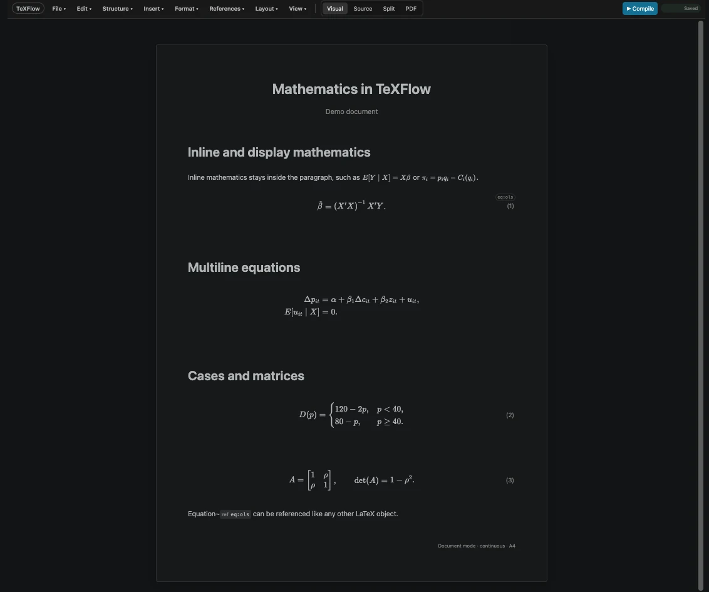
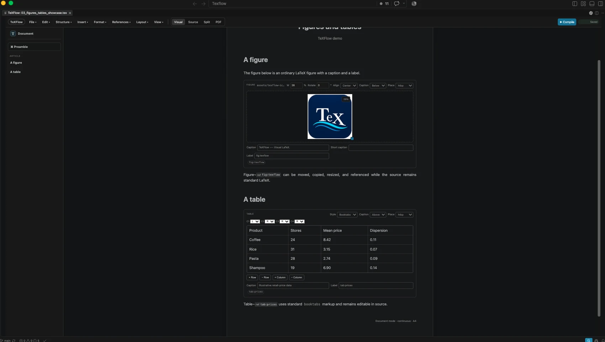
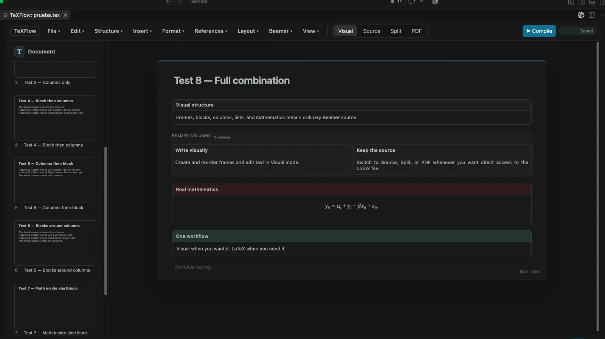
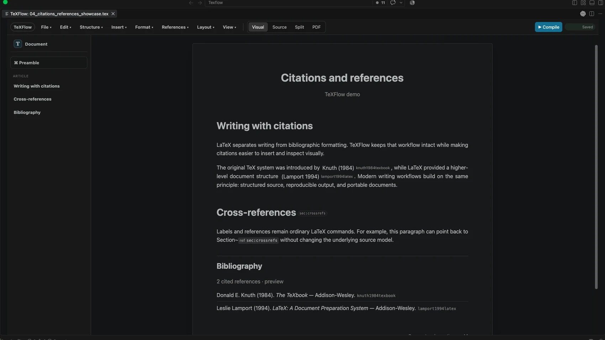

```{=html}
<div class="texflow-page">
<header class="tf-topbar"><div class="tf-topbar-inner"><a class="tf-topbar-brand" href="texflow.html"><span>TeXFlow</span></a><nav class="tf-topbar-links"><a href="#features">Features</a><a href="#mathematics">Mathematics</a><a href="#figures-tables">Figures & Tables</a><a href="#beamer">Beamer</a><a href="#citations">Citations</a><a href="https://github.com/LeandroZipitria/texflow">GitHub</a><a class="tf-home-link" href="index.html">Leandro Zipitría ↗</a></nav></div></header>
<section class="tf-hero">
  <div class="tf-shell">
    <div class="tf-brand"><span>TeXFlow</span></div>
    <div class="tf-hero-grid">
      <div>
        <span class="tf-badge">Visual LaTeX inside VS Code</span>
        <h1>TeX<span class="tf-accent">Flow</span> —<br>Visual LaTeX</h1>
        <div class="tf-tagline">Write LaTeX, <em>without</em> writing LaTeX.</div>
        <p class="tf-description">A visual LaTeX editor inside VS Code. Write naturally while keeping your <code>.tex</code> files intact and accessible.</p>
        <div class="tf-source-card"><strong>Your <code>.tex</code> file remains the source of truth.</strong><span>Visual when you want it. LaTeX when you need it.</span></div>
        <div class="hero-actions"><a class="btn-site btn-primary-site" href="https://github.com/LeandroZipitria/texflow">View on GitHub →</a><a class="btn-site btn-secondary-site" href="https://marketplace.visualstudio.com/items?itemName=leandrozipitria.texflow">VS Code Marketplace</a></div>
      </div>
      <div class="tf-shot"></div>
    </div>
  </div>
</section>

<div id="features" class="tf-shell tf-feature-strip">
  <div class="tf-feature-grid">
    <div class="tf-feature"><span class="tf-symbol">⌘</span><strong>Inside VS Code</strong><span>Work in the editor you already know.</span></div>
    <div class="tf-feature"><span class="tf-symbol">◉</span><strong>Visual editing</strong><span>Write naturally and see the document structure.</span></div>
    <div class="tf-feature"><span class="tf-symbol">Σ</span><strong>Real LaTeX</strong><span>Math, figures, tables, citations, and references stay LaTeX.</span></div>
    <div class="tf-feature"><span class="tf-symbol">.tex</span><strong>Source of truth</strong><span>Your source stays accessible, editable, and portable.</span></div>
    <div class="tf-feature"><span class="tf-symbol">↗</span><strong>Built for workflows</strong><span>Move between Visual, Source, Split, and PDF.</span></div>
  </div>
</div>

<section id="mathematics" class="tf-section">
  <div class="tf-shell tf-grid">
    <div class="tf-copy"><span class="label">Mathematics</span><h2>Real mathematics, visually editable</h2><p>Work with inline and display mathematics, multiline equations, cases, matrices, and numbered equations while retaining ordinary LaTeX underneath.</p></div>
    <div class="tf-shot"></div>
  </div>
</section>

<section id="figures-tables" class="tf-section alt">
  <div class="tf-shell tf-grid reverse">
    <div class="tf-shot"></div>
    <div class="tf-copy"><span class="label">Figures & Tables</span><h2>Figures and tables, not just text</h2><p>Insert, resize, caption, label, and edit figures and tables visually. The underlying document remains standard LaTeX.</p></div>
  </div>
</section>

<section id="beamer" class="tf-section">
  <div class="tf-shell tf-grid">
    <div class="tf-copy"><span class="label">Beamer</span><h2>Visual editing for Beamer presentations</h2><p>Build and edit presentations with frames, blocks, columns, lists, and mathematics in Visual mode while keeping the underlying <code>.tex</code> source intact and accessible.</p></div>
    <div class="tf-shot"></div>
  </div>
</section>

<section id="citations" class="tf-section alt">
  <div class="tf-shell tf-grid">
    <div class="tf-copy"><span class="label">Citations & References</span><h2>Citations and references without leaving your document</h2><p>Insert citations, inspect keys, manage cross-references, and preview your bibliography while preserving the usual LaTeX workflow.</p></div>
    <div class="tf-shot"></div>
  </div>
</section>

<section class="tf-section alt">
  <div class="tf-shell">
    <div class="tf-final">
      <div><h2>Your <code>.tex</code> file remains the source of truth.</h2><p><em>Visual when you want it. LaTeX when you need it.</em></p><p style="margin-top:12px">TeXFlow is open source. Explore the project, report issues, and follow development on GitHub.</p></div>
      <div class="button-row" style="justify-content:flex-end"><a class="btn-site" style="background:#19bedf;color:#041423;border-color:#19bedf" href="https://github.com/LeandroZipitria/texflow">View on GitHub →</a></div>
    </div>
  </div>
</section>
</div>
```
